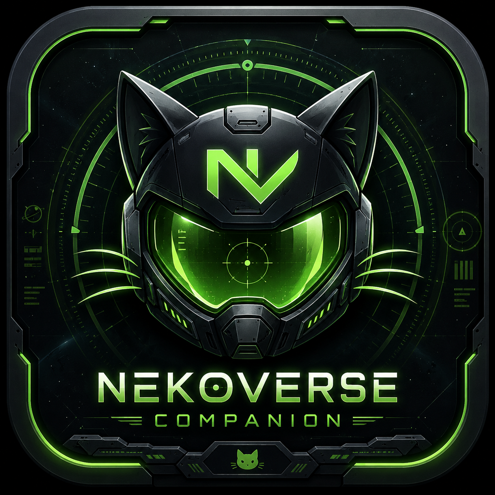

# NekoVerse Companion

<p align="center">
  
</p>

> A modern Star Citizen desktop companion created by **NekoSuneVR**.

NekoVerse Companion brings the things you normally keep in separate tabs into one green sci-fi command deck: current LIVE/PTU state, a news feed, FleetYards ship search, voice-triggered utility controls, hardware-aware graphics recommendations, and a cautious third-party marketplace finder.

**Status:** early public MVP / v0.1.0

## Highlights

- **LIVE + PTU status** – refreshes the current Star Citizen channel state from RSI support data and keeps a conservative fallback for offline periods.
- **News deck** – retrieves Comm-Link data through the Star Citizen Wiki API/RSI archive mirror and opens the original source externally.
- **Neko voice assistant** – Windows speech recognition + TTS, wake words and typed chat backed by the NekoSuneVR public Ollama endpoint.
- **Native Ollama model picker** – defaults to `https://ollama.nekosunevr.co.uk` and `qwen2.5:3b`, scans `/api/tags`, displays model details/capabilities and lets the user change the assistant model from the app UI.
- **Expanded voice command catalog** – flight/landing, docking, ship power/lights/access, NAV/quantum, cruise/movement, scanning, industrial modes, ground vehicles, camera/comms, helmet/inventory, medical and SOS/rescue actions.
- **Tap + hold controls** – normal commands can tap a configured combination while actions such as Rescue Beacon can intentionally hold a key for a configured duration.
- **FleetYards search** – searches the public FleetYards ship database and opens full model pages.
- **Marketplace finder** – deep-searches public Star Hangar, Space Foundry and The Impound results with an LTI text filter and a prominent grey-market warning.
- **Adaptive optimizer** – detects CPU/GPU/RAM/VRAM, recommends a performance tier and can safely change the local renderer setting with a timestamped backup.
- **Modern UI** – React + Tailwind CSS, dark green HUD styling inspired by space-sim cockpit interfaces without shipping copyrighted Star Citizen artwork.
- **Multi-platform releases** – GitHub Actions builds Windows x64 NSIS/portable EXEs plus Linux AMD64 AppImage/DEB packages, checksums them and publishes tagged releases with generated changelogs.

See **`docs/COMMANDS.md`** for the full command catalog and configuration examples.

## Important fair-play boundary

NekoVerse is a **companion/accessibility tool**, not a bot or cheat. Voice commands only trigger explicit user-configured key actions. It does not implement combat automation, autonomous navigation, unattended gameplay loops, aim/recoil assistance, memory/process injection, packet manipulation or anti-cheat bypasses. See `docs/SECURITY.md`.

## Marketplace warning

Third-party pledge stores are a grey market. They are not CIG/RSI-supported purchases, and NekoVerse does **not** call a store “safe”. The app only searches public listings and opens the seller page. Confirm the exact pledge, insurance (including LTI), seller, escrow/refund rules and transfer yourself. See `docs/MARKETPLACE.md`.

## Optimizer philosophy

Star Citizen changes frequently, and aggressive “FPS tweak packs” can make a machine less stable. NekoVerse therefore uses a reversible approach:

1. Detect hardware.
2. Recommend renderer, upscaler, texture, cloud and resolution choices.
3. If you click **Apply safe renderer profile**, back up `GraphicsSettings.json` and modify only the renderer field.
4. Keep the rest as visible in-game recommendations rather than writing undocumented CVars.
5. **Restore backup** puts the latest NekoVerse backup back in place.

The UI also explains that Vulkan can improve CPU-side performance on suitable hardware while some current Star Citizen builds may exhibit Vulkan-specific severe FPS drops; in that case use the DirectX/D3D fallback.

## Setup

Requirements:
- Windows 10/11 for System.Speech voice input/output and Windows hotkey output.
- Linux AMD64 can run the desktop UI/build, while Windows-only voice/hotkey features gracefully remain unavailable there.
- Node.js 22 for development/building.
- Star Citizen installed only if you want optimizer/hotkey features.

```bash
npm install
npm run dev
```

Build Windows x64 installer + portable executable:

```bash
npm run check
npm run dist:win:x64
```

Build Linux AMD64 AppImage + DEB:

```bash
npm run check
npm run dist:linux:x64
```

Outputs are written to `release/`.

## Configure voice commands

Open **Settings → Star Citizen voice / hotkey commands** and make the hotkeys match your own Star Citizen keybinds. Blank bindings are disabled. Star Citizen allows custom keybinding profiles, so NekoVerse treats its included bindings as editable starting points rather than immutable game controls.

Default wake words are `neko`, `nekoverse`, and `computer`.

Examples:
- **“Neko, request landing.”**
- **“Neko, gear down.”**
- **“Neko, headlights on.”**
- **“Neko, open the ramp.”**
- **“Neko, cruise control.”**
- **“Neko, remove my helmet.”**
- **“Neko, call rescue.”**

## Neko AI / Ollama

The assistant uses the **native Ollama API**, not OpenAI’s API and not an OpenAI compatibility layer.

Default configuration:

```text
Server: https://ollama.nekosunevr.co.uk
Model:  qwen2.5:3b
```

From **Settings → Neko AI — native Ollama**, click **Scan models**. NekoVerse calls `/api/tags` on the configured server and shows the available model names, parameter sizes, quantization levels, sizes and reported capabilities. Models that only expose embeddings remain visible but are disabled for assistant selection.

Assistant conversations use `/api/chat` with streaming disabled so the desktop app receives a single JSON reply. No API key is required by the default NekoSuneVR endpoint.

## Data integrations

- NekoSuneVR Ollama – native `/api/tags` model discovery and `/api/chat` assistant responses.
- RSI support / Star Citizen website – current channel status and original source links.
- Star Citizen Wiki API – community API over RSI archive/game data. Public projects should credit the service and follow its terms.
- FleetYards – public ship database/API.
- Star Hangar, Space Foundry and The Impound – public third-party listing search only; no account or purchasing integration.

NekoVerse caches no RSI login credentials and does not attempt to access private account data.

## Repository / releases

The included workflow builds Windows x64 and Linux AMD64 on pushes/PRs and uploads workflow artifacts. Pushing a version tag also publishes a GitHub Release with generated changelog notes and SHA-256 checksums.

```bash
git tag v0.1.0
git push origin v0.1.0
```

The release tag is used as the package version during CI, so a tag such as `v0.2.0` produces `0.2.0` filenames even if the checked-in package version has not yet been bumped.

`electron-builder` is explicitly run with `--publish never`; GitHub Release publishing is handled only by the final Actions release job. This avoids duplicate uploads and token errors during packaging.

## Project layout

```text
NekoVerse-Companion/
├─ electron/
│  ├─ main.cjs
│  ├─ preload.cjs
│  └─ services/
│     ├─ commands.cjs
│     ├─ assistant.cjs
│     ├─ ollama.cjs
│     ├─ hotkeys.cjs
│     └─ ...
├─ src/
│  ├─ App.jsx
│  ├─ index.css
│  └─ lib/api.js
├─ docs/
│  └─ COMMANDS.md
├─ .github/
│  ├─ workflows/build-release.yml
│  └─ release.yml
└─ package.json
```

## Credits

Created by **NekoSuneVR**.

This is an unofficial community project and is not affiliated with, endorsed by, or sponsored by Cloud Imperium Games or Roberts Space Industries. Star Citizen and related marks/assets belong to their respective owners.

## License

MIT © 2026 NekoSuneVR